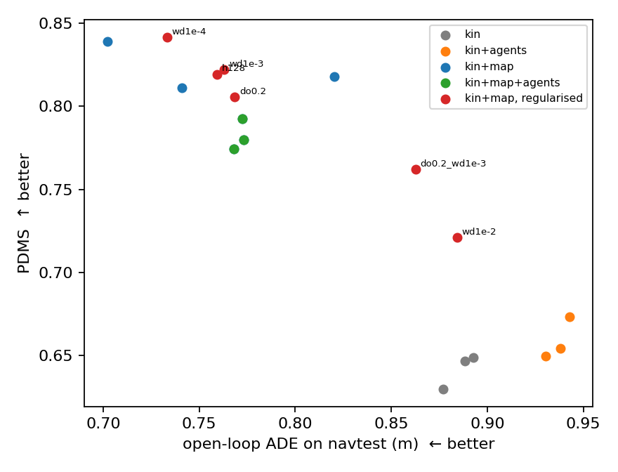

# NAVSIM ability ladder — what actually caps planning scores?

[](https://github.com/LUOaini1213/navsim-ability-ladder/actions/workflows/ci.yml)

Instead of training one planner and reporting a number, this builds a **ladder of
agents where each rung adds exactly one piece of information**, scores them all
on the same metric cache, and attributes the gaps. Then it asks the two questions
the ladder sets up: *which slot can a learned component actually fill*, and *does
the open-loop loss you train on tell you which model to ship*.

The study now runs on the full **`navtest` split: 12,146 scenes, 136 logs**, with
the learned models trained on **navtrain (103,288 scenes, 1,192 logs)**, three
seeds per cell. An earlier version used the 563-scene `warmup_test_e2e` split;
it is kept below, because one of its conclusions **reversed** when the sample
size grew, and that reversal is itself a result.

Every number comes from per-scene CSVs written by NAVSIM's own
`run_pdm_score.py`. The analysis scripts only read those CSVs — they never re-run
an evaluation, so nothing here can drift from the raw output. **The CSVs are in
this repository**, so every table and confidence interval reproduces from a plain
clone with no dataset, no devkit and no GPU:

```bash
python -m unittest discover -s tests -v              # regenerates every report and compares byte for byte
python analysis/analyze_navtest.py                   # -> results/navtest/*.md   (12,146 scenes, 56 runs)
python analysis/analyze_ci.py                        # -> results/ci_report.md   (the 563-scene study)
python analysis/analyze_navtest.py --check README.md # the navtest numbers below, recomputed
python analysis/make_summary.py --check README.md    # the 563-scene numbers below, recomputed
```

**The pipeline reproduces the published baselines.** On the same cache, in
percent: ConstantVelocity 20.7 (paper 20.6), the official EgoStatusMLP
checkpoints 65.5 / 67.4 / 66.3 (paper 66.4 ± 0.9), Human 94.6 (paper 94.8).
TransFuser (paper 83.9) was **not** run — it needs the sensor blobs, which are
not downloaded here — so it is quoted, never reproduced.

## The ladder on navtest

12,146 scenes, one metric cache. `Priv*` and `Human` consume ground truth or map
privilege: they are **upper bounds, not results**. Full sub-scores, failure rates
and paired intervals in [`results/navtest/ladder.md`](results/navtest/ladder.md).

| agent | what it sees | PDMS | DAC |
|---|---|---:|---:|
| ConstantVelocity | speed only | 0.207 | 0.578 |
| Kinematic rule | v, a, driving command | 0.489 | 0.635 |
| PrivBrake rule | + GT boxes | 0.529 | 0.702 |
| EgoStatusMLP (official, seed 0) | learned kinematics, blind | 0.655 | 0.773 |
| EgoStatusMLP (official, seed 1) | learned kinematics, blind | 0.674 | 0.793 |
| EgoStatusMLP (official, seed 2) | learned kinematics, blind | 0.663 | 0.782 |
| PrivMap rule, IDM speed | + GT map centerline | 0.775 | 0.926 |
| PrivMapKin rule | + GT map centerline | 0.785 | 0.930 |
| PrivGTPathKin | logged path, rule speed | 0.796 | 0.946 |
| PrivMapGTSpd | GT map path, human speed | 0.835 | 0.927 |
| Human | logged future | 0.946 | 1.000 |

**1. The map is worth about seven times what ground-truth boxes are worth.**
On the kinematic rung, adding the on-route centerline is **+0.296 [+0.288,
+0.305]**; adding ground-truth detection boxes and a brake is **+0.040 [+0.035,
+0.044]**. The map buys drivable-area compliance (DAC +0.295); the boxes buy
collision avoidance (NC +0.065) and hand back progress (EP −0.042).

**2. The remaining headroom is speed, not geometry.** With the path fixed to the
centerline, swapping the rule speed law for the human speed profile is **+0.049
[+0.045, +0.053]**. With the speed fixed, swapping the centerline for the logged
path is **+0.010 [+0.003, +0.017]**. Where to go is close to solved by the map;
how fast to go is not.

## What a learned trajectory model is allowed to see

A 2×2 factorial: one MLP per cell regresses the eight future poses from ego
kinematics (8 dims), optionally the centerline (20×4) and optionally the nearest
eight dynamic GT boxes plus the lead gap (8×11 + 2). Three seeds each, trained on
navtrain, checkpoint = last epoch (never selected by validation loss). Per-seed
values and every interval: [`results/navtest/factorial.md`](results/navtest/factorial.md).

| inputs | mean open-loop val L1 | PDMS |
|---|---:|---:|
| kin | 0.382 | 0.642 |
| kin+agents | 0.381 | 0.659 |
| kin+map | 0.290 | 0.823 |
| kin+map+agents | 0.295 | 0.782 |

**3. Ground-truth perception is not a free input.** The map effect is large in
every seed (+0.163 to +0.209). The box effect on its own is not significant in
two seeds of three — and once the model already has the map it is significantly
**negative in all three**: −0.044, −0.031, −0.047, every interval excluding zero.
The open-loop loss barely moves (0.290 → 0.295), so this is invisible to the
training objective. Eighty-eight dimensions of perfect perception cost this model
capacity it needed elsewhere.

**4. With the map, a small MLP matches a sensor-fusion planner.** `kin+map`
averages 0.823 and its best variant reaches 0.841, against TransFuser's published
0.839 — from an 88-dimensional input and three hidden layers. The claim is not
that the MLP is better; it is that **most of what the sensor stack has to deliver
for this score is the on-route centerline**.

## Who draws the path, who paces it

The rule path is the centerline; the rule speed is a constant-acceleration law.
`ds` models predict only progress along the rule path. Full table and per-seed
intervals: [`results/navtest/path_speed.md`](results/navtest/path_speed.md).

| path | speed | PDMS |
|---|---|---:|
| rule (map centerline) | rule (kinematic) | 0.785 |
| rule (map centerline) | learned, blind | 0.805 |
| rule (map centerline) | learned, sees map | 0.817 |
| learned (sees map) | rule (kinematic) | 0.806 |
| learned (sees map) | learned | 0.823 |
| rule (map centerline) | human (upper bound) | 0.835 |

**5. The learned component earns its place in the speed profile and nowhere
else.** Pacing a hand-drawn line beats the hand speed law in every seed (+0.028,
+0.034, +0.032) and recovers about two thirds of the distance to the human speed
profile. Letting the model draw the line instead is not separable from the rule
(−0.004 with the interval spanning zero, +0.008, −0.022 across seeds). Giving the
speed model the GT boxes as well changes nothing or hurts slightly.

## How far can you trust the open-loop loss?

Same architecture, same data, seed 0, only the regularisation changes. The
checkpoint is always the last epoch, so validation L1 is what a loss-based
selection would see. [`results/navtest/regularisation.md`](results/navtest/regularisation.md).

| regularisation | open-loop val L1 | ΔL1 | PDMS | ΔPDMS vs baseline |
|---|---:|---:|---:|---|
| none (baseline) | 0.3184 | — | 0.818 | — |
| wd 1e-4 | 0.2866 | −0.032 | 0.841 | **+0.024 [+0.019, +0.028]** |
| wd 1e-3 | 0.3099 | −0.009 | 0.822 | +0.004 [−0.001, +0.010] |
| wd 1e-2 | 0.3646 | +0.046 | 0.721 | −0.097 [−0.104, −0.090] |
| dropout 0.2 | 0.2945 | −0.024 | 0.805 | **−0.012 [−0.018, −0.007]** |
| dropout 0.2 + wd 1e-3 | 0.3347 | +0.016 | 0.762 | −0.056 [−0.062, −0.049] |
| hidden 128 | 0.2992 | −0.019 | 0.819 | +0.002 [−0.004, +0.007] |



**6. The open-loop loss is a coarse filter, not a selection criterion.** It is
not useless: over the nine map-conditioned runs, rank correlation between navtest
displacement error and PDMS is −0.83, and it correctly flags the models that
heavy regularisation broke. It fails where a leaderboard lives. Among the seven
runs that are actually competitive (ADE 0.70–0.82, PDMS 0.805–0.841) the rank
correlation falls to −0.64 and inverts in places: dropout 0.2 fits better than
the unregularised baseline (ADE 0.768 vs 0.820) and scores worse (0.805 vs
0.818). Two regularisers that improve validation L1 by comparable amounts —
wd 1e-4 by 0.032, dropout 0.2 by 0.024 — move the score +0.024 and −0.012, both
intervals excluding zero. And *within* a run the per-scene correlation between
displacement error and PDMS never exceeds 0.38 in magnitude, so the loss does not
tell you which scenes will fail either.

## What changed when the split changed

| conclusion | 563-scene warmup | navtest, 12,146 |
|---|---|---|
| map ≫ GT boxes | held, no intervals | held, +0.296 vs +0.040, intervals tight |
| **a learned model given the map cannot use it** | **held: 0.527 vs hand rule 0.730** | **reversed: 0.823 vs 0.785** |
| rule path + learned speed | +0.033, interval spanned zero | +0.028 to +0.034, significant in all seeds |
| open-loop loss vs score | one anecdote | 7-point sweep: ranks broken models, not competitive ones |
| dropping IDM, swapping the logged path | intervals spanned zero | both significant |
| boxes × map interaction | not answerable | significantly negative, all seeds |

The reversal is the honest headline. On 563 scenes with ~3,000 training samples,
the learned map model lost to the hand-written follower by 0.203 and the write-up
concluded that the bottleneck was inductive bias. With 103,288 training samples
and the same architecture, the same model beats that follower by 0.038. The old
conclusion was a statement about the sample size, stated as if it were a
statement about the method.

## Scope and limitations

- **NAVSIM's PDM score is non-reactive simulation**, not closed loop: other
  agents replay their logs and do not respond. Nothing here is a closed-loop
  result, and the text says "simulation score" throughout.
- `NC` and `DAC` enter the score multiplicatively, so an input that fixes route
  adherence is structurally favoured. That is part of why the map effect is large.
- **The privileged rungs are not deployable.** GT map and GT boxes are analysis
  instruments; an online-mapping version is future work, not a claim made here.
- The learned models are MLPs. The official EgoStatusMLP (0.664 mean) beats our
  matching `kin` cell (0.642); the training recipes differ and we did not tune.
- `PrivGTPathKin` scores comfort 0.761 — an artefact of resampling logged poses
  at the wrong timing, not a property of the logged path.
- Single benchmark, NAVSIM v1.1. EPDMS and the v2 two-stage splits are not run.
- The scoring formula was never modified. Windows portability fixes (packaging
  scope, POSIX file locks, cache-path splitting, subnormal floats) touched
  neither the metric nor any upstream agent — see [`docs/WINDOWS.md`](docs/WINDOWS.md).

---

# The earlier study: 563 scenes (`warmup_test_e2e`)

Kept because the reversal above only means something next to it. Thirteen agents
were scored: the nine rungs, the learned `MapMLP`, and three variants
(`MapMLP-reg`, `SpeedMLP`, `SpeedMLP` at 200 epochs). All thirteen are in
`results/`; the tables here show the rungs plus the variants that changed a
conclusion.

## The ladder (563 scenes, same metric cache)

| agent | what it sees | deployable | PDMS | DAC |
|---|---|---|---:|---:|
| ConstantVelocity | speed only | yes | 0.233 | 0.643 |
| Kinematic | v, a, driving command | yes | 0.580 | 0.737 |
| PrivBrake | GT boxes, no map | no | 0.602 | 0.766 |
| EgoStatusMLP | learned, blind | yes | 0.640 | 0.806 |
| MapMLP | learned, sees centerline | no | 0.548 | 0.798 |
| PrivMap | map centerline + IDM | no | 0.786 | 0.934 |
| PrivMapKin | map centerline + kinematic | no | 0.802 | 0.950 |
| **SpeedMLP** | **map centerline + learned speed** | no | **0.806** | **0.964** |
| PrivGTPathKin | logged path + kinematic | no | 0.833 | 0.973 |
| PrivMapGTSpd | map centerline + human speed | no | 0.866 | 0.950 |
| Human | logged future | no | 0.945 | 0.998 |

`Priv*` and `Human` consume ground truth or map privilege. They are **upper
bounds, not results**. Learned rows on this split are contaminated (see below);
their clean numbers are in the next table.

## What the ladder says

**Most of ConstantVelocity's pain is kinematics, not model capacity.**
Adding acceleration and command yaw alone moves PDMS 0.233 → 0.580 and cuts the
NC failure rate from 39% to 12%. Fix the motion model before reaching for a net.

**Perception boxes do not close the gap; the map does.**
GT detection boxes plus a brake reach only 0.602 with DAC stuck at 0.766.
Swapping in the on-route lane centerline moves DAC 0.737 → 0.950. *(This one held
on navtest, with much tighter intervals.)*

**Giving a learned model the map is not the same as it using the map.**
`MapMLP` is trained on the *identical* centerline features the hand-written
follower consumes, and asked to regress the whole trajectory. On the clean split
it scores 0.527 against the hand rule's 0.730 — **+0.203, 95% CI [+0.118,
+0.291]** in favour of the hand rule. *(This one reversed on navtrain-scale data:
the bottleneck was the 3,000-sample training set, not the inductive bias.)*

**Open-loop imitation quality is not simulation safety.**
The blind MLP has a low open-loop L1 and still gets zeroed by DAC on 90 of 563
scenes. A multiplicative safety metric does not care how close your trajectory
looked.


*One of the 90: the blind MLP keeps up with the human in progress (left) and still loses the scene, because it under-turns by a few decimetres (right) and the drivable-area check is multiplicative. NC and TTC failure examples are in `results/figures/`.*

## Putting a learned part back in: three attempts

Three ways of fixing `MapMLP`, all trained on the same 51 train logs and scored
on the same 135 held-out scenes (`results/clean_ladder.md`).

| variant | what the model predicts | open-loop val L1 | PDMS, clean n=135 | vs hand rule PrivMapKin (0.730) |
|---|---|---:|---:|---|
| MapMLP | whole xyθ trajectory | 0.99 | 0.527 | −0.203 [−0.291, −0.118] |
| MapMLP-reg (h128, dropout 0.2, wd 1e-3) | whole xyθ trajectory | 0.65 | 0.425 | −0.305 [−0.396, −0.215] |
| **SpeedMLP** | **only progress along the hand-drawn centerline** | 0.76 | **0.763** | **+0.033 [−0.016, +0.083]** |
| SpeedMLP, 200 epochs | same | 0.65 | 0.747 | +0.017 |
| PrivMapGTSpd (human speed, upper bound) | — | — | 0.809 | +0.079 |

**The decomposition works; more capacity and more regularisation do not.**
Asked to draw the whole line, the learned model loses to the hand rule by 0.2.
Asked only to *pace* a line the rule has drawn, it matches the rule (0.763 vs
0.730, CI spans zero) with fewer drivable-area failures. *(On navtest the same
decomposition is significant in all three seeds.)*

**Lower open-loop loss made the simulation score worse, twice.**
Regularising `MapMLP` cut its open-loop val L1 from 0.99 to 0.65 and cut its
PDMS from 0.527 to 0.425 (−0.102, CI [−0.182, −0.024]). Training `SpeedMLP` for
200 epochs instead of 80 cut L1 from 0.76 to 0.65 and moved PDMS from 0.763 to
0.747 (CI spans zero). *(The navtest sweep replaces these two anecdotes with a
seven-point curve.)*

See `results/lab_notes.md` for the original write-up and
`results/ci_report.md` / `results/clean_ladder.md` for every CI.

## Contamination, and how it is handled

The `mini` dataset ships 64 logs and **62 of them are the `warmup_test_e2e`
logs**. Any model trained on `mini` therefore has seen 428 of the 563 evaluation
scenes. Retraining on "mini minus warmup" is not an option — two logs would
remain.

So rather than quietly reporting a contaminated number, every agent is
re-scored on the same held-out val logs (`results/clean_ladder.md`, n=135). The
non-learned agents have no training set, so this only changes what the learned
rows mean — and it makes them directly comparable to the rest.

**The cost is stated honestly.** At n=135 several effects that separated on 563
scenes no longer do: GT boxes (+0.020), dropping IDM (+0.012), swapping in the
logged path (+0.039), and the speed-vs-geometry difference-in-differences
(+0.041) all have CIs spanning zero. They are reported as suggestive, not
established. *(navtest has no such problem: navtrain and navtest share no logs.)*

## Known open issue

`privileged_brake_mini` was run twice on the warmup split and produced different
results (PDMS 0.602 / DAC 0.766, then 0.593 / 0.785). Every report here uses the
first run for consistency. Both per-scene CSVs are committed
(`results/per_scene/privileged_brake_mini*.csv`) and `python analysis/brake_rerun_diff.py`
characterizes the gap ([results/brake_rerun_diff.md](results/brake_rerun_diff.md)):
the two runs came from identical code and configuration snapshots, yet 130 of 563
scenes score differently, ego progress differs in 127 of them, and run 1 is the
higher one in 96. So the trajectory itself changed between runs with no parameter
change, which points at scene loading or the parallel scorer rather than at the
agent. **The cause is still not pinned down**; that row should not be quoted as
settled. The navtest runs were each executed once.

---

## What is and is not in this repository

| In the repo | Not in the repo |
|---|---|
| every agent and its hydra config (`agents/`, `configs/`) | the NAVSIM / nuplan devkits, the OpenScene logs, the maps (upstream licences) |
| per-scene PDM scores: 13 agents × 563 scenes and **56 runs × 12,146 scenes** (`results/*/per_scene/`) | the metric caches, the frozen feature files, the trained checkpoints |
| the analysis scripts and tests that regenerate every report from those CSVs | the sensor blobs — no camera / LiDAR agent was run |
| the reports, the figures, and the training metadata of all 27 cells (`results/navtest/cells.csv`) | anything that needs a GPU |

## Layout

```
agents/     kinematic, privileged brake / centerline, MapMLP, SpeedMLP,
            ladder_features.py (the shared input blocks), ladder_mlp_agent.py (every navtest cell)
configs/    matching hydra configs (paths via ${oc.env:NAVSIM_EXP_ROOT})
analysis/   ladder_io.py (shared loading + bootstrap)
            analyze_navtest.py   navtest tables, from results/navtest/per_scene
            analyze_ci.py, analyze_clean_ladder.py, make_summary.py   the 563-scene study
            build_features.py, train_ladder.py   navtrain feature extraction and cell training
            analyze_openloop.py, summarize_pdm.py, export_per_scene.py   workspace-side tools
tests/      bootstrap sanity; every report regenerates byte for byte from the committed CSVs
scripts/    bash runners for caching, scoring and training + env.sh; the older PowerShell runners
results/    per_scene/ (563) and navtest/ (12,146): CSVs, reports, figures
docs/       WINDOWS.md — the four portability fixes and two CPU performance traps
```

## Reproducing

This repository holds only original work. It is **not** a runnable checkout: the
NAVSIM devkit, the nuplan devkit, the OpenScene logs and the maps are all
upstream and separately licensed.

Nothing below is needed to check a number in this README — the analysis scripts
read the committed per-scene CSVs when no workspace is configured, which is what
CI does on every push.

1. Install NAVSIM v1.1; download the maps, the `test` (navtest) and `trainval`
   (navtrain) log metadata. Sensor blobs are not needed for anything here.
2. Copy `agents/*.py` into `navsim/navsim/agents/` and `configs/*.yaml` into
   `navsim/navsim/planning/script/config/common/agent/`.
3. `source scripts/env.sh` after pointing it at your workspace.
4. Build the cache and score the rule ladder:
   `scripts/run_metric_cache.sh navtest 6` then `scripts/run_ladder_rules.sh navtest 5`.
5. Freeze the features and train the 27 cells (CPU is fine):
   `python analysis/build_features.py --split navtrain --workers 5` then
   `scripts/train_cells.sh "0 1 2" 40`.
6. Score them: `scripts/run_ladder_learned.sh navtest 6`.
7. `python analysis/export_per_scene.py --split navtest` copies the per-scene
   CSVs back into `results/navtest/per_scene/`, and
   `python analysis/analyze_navtest.py` rebuilds every table from them.

Wall-clock on a 20-thread CPU with no GPU: metric cache 71 min, rule ladder
1.3 h, feature extraction 78 min, 27 cells 2 h, 45 scoring runs 6.7 h.

## Licence

MIT for the code in this repository. The NAVSIM and nuplan devkits are
Apache-2.0 upstream; the OpenScene/nuPlan data is under its own licence and is
not redistributed here.
